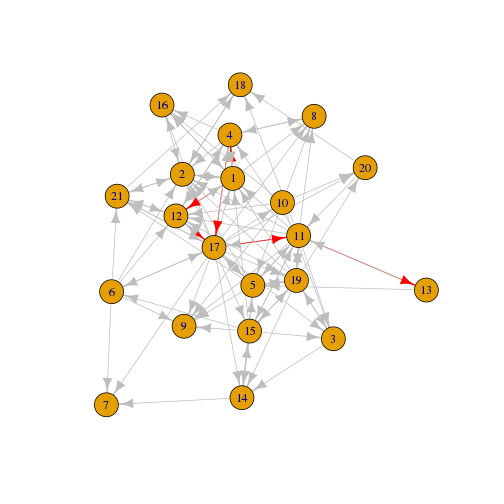
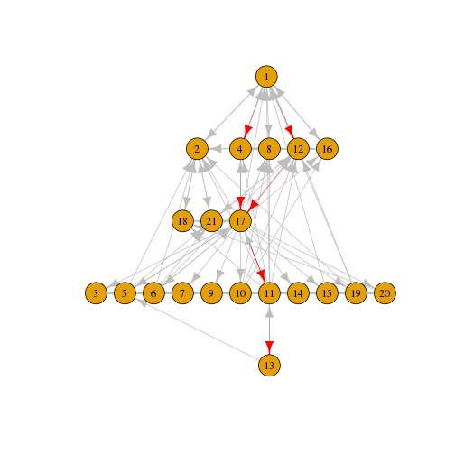
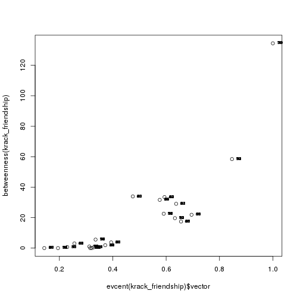
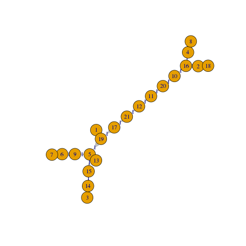

Social Network Analysis 101 (2)
========================================================
author: 許晉源 (Ed Hsu)
date: 2016.12.17 
autosize: true


本次 Workshop 重點
========================================================

- Data Collection
- Node-Level Statistics
- Network-Level Statistics


資料取得 (Data Collection)
========================================================

由於人際網路的資料可能相當龐大及複雜，為了可以快速取得相關的資料及數據進行分析，我們可以根據問題選定目標族群，採用滾雪球取樣 (Snowball Sampling)

滾雪球取樣法是一種 "非隨機式抽樣" 的方法，透過人際關係網路，類似滾雪球般從一個人 (端點) 找到下一個人 (端點) ，逐漸累積到足夠的調查樣本為止稱之，這種抽樣方式常用於社會學研究

滾雪球抽樣法的優點在於可快速收集到少數人際關係樣本，此方法使用得當不但費用少且簡單有效，但滾雪球抽樣法的缺點也是 "非隨機式抽樣"，在某特定的人際網路中，抽取的樣本可能具有極高的同質性

<http://terms.naer.edu.tw/detail/1678729/>


滾雪球取樣 (Snowball Sampling)
========================================================

通常在進行 Snowball Sampling 時，我們會先選定位於人際關係網路中重要的點，再以此去擴散抽樣的範圍．並不會無限制的一直抽樣下去，大概會限縮於三層的關係 (朋友、朋友的朋友、朋友的朋友的朋友)

影片: <https://www.youtube.com/watch?v=BIEteh4nryM>


常見的資料來源
========================================================

- 問卷
- Blog
- 企業內部資料 (名單、紀錄、Email、Log 等)
- 政府公開資料
- 社交社群網站 (FaceBook、Twitter)


Node-Level Statistics
========================================================

根據前面 Snowball Sampling 的描述，我們該如何找尋重要的點呢?

重要的點包含四種:
- 人際網路的明星
- 人際網路最有效的訊息傳遞者
- 人際網路中不同群體的樞紐
- 人際網路中幕後決策的藏鏡人


用 krack_friendship 來操作看看吧
========================================================

接下來我們聚焦在 friendship 這個網路，透過一些指標找尋這些重要的點


度數 (Degree)
========================================================

度數 (degree) 指的是某端點 (vertex) 與其他端點的連接線的數目，其中又因連接線的方向分為兩種
- in-degree : 連入的數目
- out-defree : 連出的數目

以 friendship 來說，代表友誼的關係並不是雙向的 (天啊~好像有點殘忍~囧)


來思考一下 in-degree 的意義
========================================================

套用前面的 krack_friendship 觀察看看，in-degree 越高，代表很多人都把你加入好友名單，表示人氣越旺


```r
# 2 號員工是公司內最受歡迎的人，大概是公司裡的好好先生
deg_friendship_in <- degree(krack_friendship, mode="in") 
deg_friendship_in
```

```
 1  2  3  4  5  6  7  8  9 10 11 12 13 14 15 16 17 18 19 20 21 
 8 10  5  5  6  2  3  5  6  1  6  8  1  5  4  4  6  4  5  3  5 
```


配合一些簡單的統計
========================================================


```r
# 可以用 summary() 很快地看出資料的分佈狀況
summary(deg_friendship_in)
```

```
   Min. 1st Qu.  Median    Mean 3rd Qu.    Max. 
  1.000   4.000   5.000   4.857   6.000  10.000 
```

```r
# mean() 計算平均值
mean(deg_friendship_in)
```

```
[1] 4.857143
```

```r
# sd() 計算標準差
sd(deg_friendship_in)
```

```
[1] 2.220039
```


畫出 in-degree 的分佈 (1)
========================================================


```r
# 搭配使用 R 本身與 igraph 套件中的函式
degree.distribution(krack_friendship, mode="in")
```

```
 [1] 0.00000000 0.09523810 0.04761905 0.09523810 0.14285714 0.28571429
 [7] 0.19047619 0.00000000 0.09523810 0.00000000 0.04761905
```


畫出 in-degree 的分佈 (2)
========================================================


```r
plot(degree.distribution(krack_friendship, mode="in"), xlab="node degree")
lines(degree.distribution(krack_friendship, mode="in"))
```


來思考一下 out-degree 的意義
========================================================

套用前面的 krack_friendship 觀察看看，out-degree 越高，表示好友名單越長，認識的人越多


```r
# 17 號員工認識最多人，大概是人資主管一類的
deg_friendship_out <- degree(krack_friendship, mode="out") 
deg_friendship_out
```

```
 1  2  3  4  5  6  7  8  9 10 11 12 13 14 15 16 17 18 19 20 21 
 5  3  2  6  7  6  0  1  0  7 13  4  2  2  8  2 18  1  9  2  4 
```


配合一些簡單的統計
========================================================


```r
# 可以用 summary() 很快地看出資料的分佈狀況
summary(deg_friendship_out)
```

```
   Min. 1st Qu.  Median    Mean 3rd Qu.    Max. 
  0.000   2.000   4.000   4.857   7.000  18.000 
```

```r
# mean() 計算平均值
mean(deg_friendship_out)
```

```
[1] 4.857143
```

```r
# sd() 計算標準差
sd(deg_friendship_out)
```

```
[1] 4.475329
```


畫出 out-degree 的分佈 (1)
========================================================


```r
degree.distribution(krack_friendship, mode="out")
```

```
 [1] 0.09523810 0.09523810 0.23809524 0.04761905 0.09523810 0.04761905
 [7] 0.09523810 0.09523810 0.04761905 0.04761905 0.00000000 0.00000000
[13] 0.00000000 0.04761905 0.00000000 0.00000000 0.00000000 0.00000000
[19] 0.04761905
```


畫出 out-degree 的分佈 (2)
========================================================


```r
plot(degree.distribution(krack_friendship, mode="out"), xlab="node degree")

lines(degree.distribution(krack_friendship, mode="out"))
```


可達性 (Reachability)
========================================================

任意兩個端點間可以存在不同路徑，任意兩端點間若存在一路徑，則具有可達關係 (Reachable)
兩點若不相通，則無傳遞的路徑存在

跟 Degree 一樣，因連接線的方向分為兩種
- Reachability-In: 連入的可達性
- Reachability-Out: 連出的可達性


來思考一下 Reachability 的意義 (1)
========================================================

套用前面的 krack_friendship 觀察看看，確認端點與端點間的網路是否連通
以人際網路來說，就是誰認識誰，又可以透過誰去認識誰


```r
# 可使用 subcomponent()，確認端點與端點之間的連接性
# 這 19 個員工與 17 號員工有直接跟間接地認識關係
reach_friendship_in <- subcomponent(krack_friendship, 17, mode="in")
reach_friendship_in
```

```
+ 19/21 vertices, named:
 [1] 17 4  5  6  11 12 21 1  8  10 13 15 19 20 2  16 14 3  18
```


來思考一下 Reachability 的意義 (2)
========================================================

由 Reachability-Out 的結果來看，由 17 號員工所輻射出去的人際網路可以涵蓋公司的所有員工


```r
reach_friendship_out <- subcomponent(krack_friendship, 17, mode="out")
reach_friendship_out
```

```
+ 21/21 vertices, named:
 [1] 17 1  2  3  4  5  6  7  8  9  10 11 12 14 15 16 19 20 21 18 13
```


最短路徑 (Shortest Paths) 
========================================================

通常我們想了解網絡中端點之間的路徑距離，除了透過可達性 (Reachability)，確認端點與端點間是否有相連的關係外．可以進一步透過最短路徑 (Shortest Paths) 了解 端點與端點間相連的關係

備註: 最短路徑 (Shortest Paths) 又稱測地線距離 (Geodesic Distance) 或簡稱距離 (Distance)，一樣都是指兩端點之間最短路徑的長度


來思考一下 Shortest Paths 的意義 (1)
========================================================

套用前面的 krack_friendship 觀察看看，簡單來說 Shortest Paths 就是計算誰與誰差了幾層朋友的關係


```r
# Compute shortest paths between each pair of nodes.
sp_friendship_in <- shortest.paths(krack_friendship, mode='in')
sp_friendship_in
```

```
   1 2 3 4 5 6   7 8   9 10 11 12 13 14 15 16 17 18 19 20 21
1  0 1 2 1 2 2 Inf 2 Inf  2  1  1  2  2  1  1  1  2  1  2  2
2  1 0 2 1 1 1 Inf 2 Inf  2  1  2  2  3  2  1  1  1  1  2  1
3  3 3 0 2 2 2 Inf 3 Inf  1  1  2  2  2  1  4  1  4  1  2  2
4  1 2 3 0 2 2 Inf 1 Inf  2  1  1  2  3  2  2  1  3  2  2  2
5  3 3 2 2 0 2 Inf 3 Inf  1  1  2  1  2  1  4  1  4  1  2  2
6  3 3 3 2 2 0 Inf 3 Inf  3  2  2  3  2  1  4  1  4  2  3  2
7  3 3 2 2 2 1   0 3 Inf  3  2  2  3  1  2  4  1  4  2  3  2
8  1 2 3 1 2 2 Inf 0 Inf  1  1  2  2  3  2  2  1  3  2  2  2
9  3 3 3 2 1 1 Inf 3   0  1  1  2  2  2  1  4  1  4  2  2  2
10 3 3 4 2 2 2 Inf 3 Inf  0  2  2  3  4  3  4  1  4  3  3  2
11 3 3 2 2 1 2 Inf 3 Inf  2  0  2  1  2  1  4  1  4  1  1  2
12 1 2 2 1 2 1 Inf 2 Inf  1  1  0  2  3  2  2  1  3  1  2  1
13 4 4 3 3 2 3 Inf 4 Inf  3  1  3  0  3  2  5  2  5  2  2  3
14 3 3 1 2 1 2 Inf 3 Inf  2  2  2  2  0  1  4  1  4  1  3  2
15 3 3 2 2 2 2 Inf 3 Inf  3  1  2  2  1  0  4  1  4  1  2  2
16 1 2 3 1 2 2 Inf 2 Inf  1  2  2  3  3  2  0  1  3  2  3  2
17 2 2 3 1 1 1 Inf 2 Inf  2  1  1  2  3  2  3  0  3  2  2  1
18 2 1 3 2 2 2 Inf 3 Inf  2  1  2  2  3  2  2  2  0  2  1  1
19 3 3 1 2 1 2 Inf 3 Inf  2  1  2  2  2  1  4  1  4  0  2  2
20 3 3 2 2 2 2 Inf 3 Inf  1  2  2  3  3  2  4  1  4  1  0  2
21 2 1 3 2 1 1 Inf 3 Inf  2  2  1  2  3  2  2  1  2  2  3  0
```


來思考一下 shortest paths 的意義 (2)
========================================================

套用前面的 krack_friendship 觀察看看，簡單來說 Shortest Paths 就是計算誰與誰差了幾層朋友的關係


```r
# Inf 表示沒有聯通的最短路徑，可以對照 deg_friendship_out
sp_friendship_out <- shortest.paths(krack_friendship, mode='out')
sp_friendship_out
```

```
     1   2   3   4   5   6   7   8   9  10  11  12  13  14  15  16  17  18
1    0   1   3   1   3   3   3   1   3   3   3   1   4   3   3   1   2   2
2    1   0   3   2   3   3   3   2   3   3   3   2   4   3   3   2   2   1
3    2   2   0   3   2   3   2   3   3   4   2   2   3   1   2   3   3   3
4    1   1   2   0   2   2   2   1   2   2   2   1   3   2   2   1   1   2
5    2   1   2   2   0   2   2   2   1   2   1   2   2   1   2   2   1   2
6    2   1   2   2   2   0   1   2   1   2   2   1   3   2   2   2   1   2
7  Inf Inf Inf Inf Inf Inf   0 Inf Inf Inf Inf Inf Inf Inf Inf Inf Inf Inf
8    2   2   3   1   3   3   3   0   3   3   3   2   4   3   3   2   2   3
9  Inf Inf Inf Inf Inf Inf Inf Inf   0 Inf Inf Inf Inf Inf Inf Inf Inf Inf
10   2   2   1   2   1   3   3   1   1   0   2   1   3   2   3   1   2   2
11   1   1   1   1   1   2   2   1   1   2   0   1   1   2   1   2   1   1
12   1   2   2   1   2   2   2   2   2   2   2   0   3   2   2   2   1   2
13   2   2   2   2   1   3   3   2   2   3   1   2   0   2   2   3   2   2
14   2   3   2   3   2   2   1   3   2   4   2   3   3   0   1   3   3   3
15   1   2   1   2   1   1   2   2   1   3   1   2   2   1   0   2   2   2
16   1   1   4   2   4   4   4   2   4   4   4   2   5   4   4   0   3   2
17   1   1   1   1   1   1   1   1   1   1   1   1   2   1   1   1   0   2
18   2   1   4   3   4   4   4   3   4   4   4   3   5   4   4   3   3   0
19   1   1   1   2   1   2   2   2   2   3   1   1   2   1   1   2   2   2
20   2   2   2   2   2   3   3   2   2   3   1   2   2   3   2   3   2   1
21   2   1   2   2   2   2   2   2   2   2   2   1   3   2   2   2   1   1
    19  20  21
1    3   3   2
2    3   3   1
3    1   2   3
4    2   2   2
5    1   2   1
6    2   2   1
7  Inf Inf Inf
8    3   3   3
9  Inf Inf Inf
10   2   1   2
11   1   2   2
12   2   2   1
13   2   3   2
14   2   3   3
15   1   2   2
16   4   4   2
17   1   1   1
18   4   4   2
19   0   1   2
20   2   0   3
21   2   2   0
```


配合一些簡單的統計
========================================================


```r
mean(sp_friendship_in[which(sp_friendship_in != Inf)])
```

```
[1] 1.992519
```

```r
sd(sp_friendship_in[which(sp_friendship_in != Inf)])
```

```
[1] 0.9911831
```

```r
mean(sp_friendship_out[which(sp_friendship_out != Inf)])
```

```
[1] 1.992519
```

```r
sd(sp_friendship_out[which(sp_friendship_out != Inf)])
```

```
[1] 0.9911831
```


最短路徑 (Shortest Paths) 
========================================================


```r
shortest.paths(krack_friendship)
```

```
   1 2 3 4 5 6 7 8 9 10 11 12 13 14 15 16 17 18 19 20 21
1  0 1 2 1 2 2 2 1 2  2  1  1  2  2  1  1  1  2  1  2  2
2  1 0 2 1 1 1 2 2 2  2  1  2  2  2  2  1  1  1  1  2  1
3  2 2 0 2 2 2 2 2 2  1  1  2  2  1  1  2  1  2  1  2  2
4  1 1 2 0 2 2 2 1 2  2  1  1  2  2  2  1  1  2  2  2  2
5  2 1 2 2 0 2 2 2 1  1  1  2  1  1  1  2  1  2  1  2  1
6  2 1 2 2 2 0 1 2 1  2  2  1  3  2  1  2  1  2  2  2  1
7  2 2 2 2 2 1 0 2 2  2  2  2  3  1  2  2  1  3  2  2  2
8  1 2 2 1 2 2 2 0 2  1  1  2  2  2  2  2  1  2  2  2  2
9  2 2 2 2 1 1 2 2 0  1  1  2  2  2  1  2  1  2  2  2  2
10 2 2 1 2 1 2 2 1 1  0  2  1  2  2  2  1  1  2  2  1  2
11 1 1 1 1 1 2 2 1 1  2  0  1  1  2  1  2  1  1  1  1  2
12 1 2 2 1 2 1 2 2 2  1  1  0  2  2  2  2  1  2  1  2  1
13 2 2 2 2 1 3 3 2 2  2  1  2  0  2  2  3  2  2  2  2  2
14 2 2 1 2 1 2 1 2 2  2  2  2  2  0  1  2  1  3  1  2  2
15 1 2 1 2 1 1 2 2 1  2  1  2  2  1  0  2  1  2  1  2  2
16 1 1 2 1 2 2 2 2 2  1  2  2  3  2  2  0  1  2  2  2  2
17 1 1 1 1 1 1 1 1 1  1  1  1  2  1  1  1  0  2  1  1  1
18 2 1 2 2 2 2 3 2 2  2  1  2  2  3  2  2  2  0  2  1  1
19 1 1 1 2 1 2 2 2 2  2  1  1  2  1  1  2  1  2  0  1  2
20 2 2 2 2 2 2 2 2 2  1  1  2  2  2  2  2  1  1  1  0  2
21 2 1 2 2 1 1 2 2 2  2  2  1  2  2  2  2  1  1  2  2  0
```


計算端點與端點間所有的最短路徑
========================================================


```r
# shortest paths from node 1 to node 13
sp <- get.all.shortest.paths(krack_friendship, 1, 13)
sp
```

```
$res
$res[[1]]
+ 5/21 vertices, named:
[1] 1  12 17 11 13

$res[[2]]
+ 5/21 vertices, named:
[1] 1  4  17 11 13


$nrgeo
 [1] 1 1 2 1 2 2 2 1 2 2 2 1 2 2 2 1 2 1 2 2 2
```


在網路上畫出可能的最短路徑 (1)
========================================================


```r
# 設定一下 layout
E(krack_friendship)$color <- "grey"
for (p in sp$res) {E(krack_friendship, path=p)$color <- "red" }
```


```r
plot(krack_friendship, layout=layout.fruchterman.reingold)
```




在網路上畫出可能的最短路徑 (2)
========================================================


```r
# 有點亂，換個 layout 試試
plot(krack_friendship, 
     layout=layout.reingold.tilford)
```




中心性 (Centrality)
========================================================

中心性可分為三種，每一種所包含的意義皆不相同

- Closeness Centrality
- Betweenness Centrality
- Eigevector Centrality


Closeness Centrality
========================================================

Closeness Centrality gives a higher score to a node that has short path distance to every other nodes

Closeness Centrality 可找出人際網中最有效的訊息傳遞者 (因為該端點至該網路的其他端點最短路徑總和最小)


Closeness Centrality
========================================================


```r
closeness(krack_friendship)
```

```
          1           2           3           4           5           6 
0.020833333 0.020000000 0.020408163 0.028571429 0.030303030 0.028571429 
          7           8           9          10          11          12 
0.002380952 0.018518519 0.002380952 0.027027027 0.037037037 0.027027027 
         13          14          15          16          17          18 
0.023255814 0.020000000 0.030303030 0.015625000 0.045454545 0.014492754 
         19          20          21 
0.031250000 0.022727273 0.027027027 
```


Betweenness Centrality
========================================================

Betweenness Centrality 從網路中所有"成對"端點 (node pairs) 的最小路徑，找出座落於這些最短路徑上的點，並給予最高的分數

Betweenness Centrality 主要能夠識別人際網路溝通傳遞的樞紐點，區別多個不同且未曾有關聯的社群


用個範例說明一下
========================================================

下圖的 "4" 點 Betweenness Centrality 分數最高，為網路中的樞紐點，區分兩個不同的社群


用個範例說明一下
========================================================

下圖的 "4" 點 Betweenness Centrality 分數最高，為網路中的樞紐點，區分兩個不同的社群


```r
betweenness(bowtie_sample)
```

```
 1  2  3  4  5  6  7 
 0  0  0 18  0  0  0 
```


套用至 friendship 看看
========================================================


```r
betweenness(krack_friendship)
```

```
         1          2          3          4          5          6 
 29.066667  33.483333   1.900000  31.666667  17.416667   3.733333 
         7          8          9         10         11         12 
  0.000000   0.500000   0.000000   0.000000  58.450000  19.658333 
        13         14         15         16         17         18 
  0.000000   5.583333  22.566667   1.000000 134.433333   0.700000 
        19         20         21 
 21.883333   3.041667  33.916667 
```


Eigevector Centrality
========================================================

Eigenvector Centrality 可找出網路中連結"多個重要端點"的端點

Eigenvector Centrality 可找出幕後的藏鏡人 (最近最有名的例子大概就是崔順實吧，人際關係網路連結並不如朴槿惠，但在幕後卻有相當的影響力 :P)


用個範例說明一下
========================================================

下圖的 "4" 點 Eigenvector Centrality 分數最高，該點剛好連接了其它最重要的點 (1、5、7)


用個範例說明一下
========================================================

下圖的 "4" 點 Eigenvector Centrality 分數最高，該點剛好連接了其它最重要的點 (1、5、7)


```r
evcent(eigen_network_sample)$vector
```

```
        1         2         3         4         5         6         7 
0.8702639 0.4142136 0.4142136 1.0000000 0.6153695 0.2928932 0.6153695 
        8 
0.2928932 
```


套用至 friendship 看看
========================================================


```r
evcent(krack_friendship)$vector
```

```
        1         2         3         4         5         6         7 
0.6375787 0.5938854 0.3717857 0.5761195 0.6558157 0.3939277 0.1433684 
        8         9        10        11        12        13        14 
0.3280714 0.3157184 0.3210385 0.8468126 0.6328913 0.1947572 0.3355875 
       15        16        17        18        19        20        21 
0.5910544 0.3121997 1.0000000 0.2292990 0.6952601 0.2563457 0.4752042 
```


總結一下 (1)
========================================================

先前我們提到重要的點包含四種，我們可以用下面不同的方式找出
- 人際網路的明星 (Degree)
- 人際網路最有效的訊息傳遞者 (Closeness Centrality)
- 人際網路中不同群體的樞紐 (Betweenness Centrality)
- 人際網路中幕後決策的藏鏡人 (Eigenvector Centrality)


總結一下 (2)
========================================================


```r
order(deg_friendship_out, decreasing=TRUE)
```

```
 [1] 17 11 19 15  5 10  4  6  1 12 21  2  3 13 14 16 20  8 18  7  9
```

```r
order(closeness(krack_friendship), decreasing=TRUE)
```

```
 [1] 17 11 19  5 15  4  6 10 12 21 13 20  1  3  2 14  8 16 18  7  9
```


總結一下 (3)
========================================================

friendship 這個資料集真的不太適合拿來示範，怎麼都是同一個人 (17號員工)

各位有空可以回去試試其他的資料集


```r
order(betweenness(krack_friendship), decreasing=TRUE)
```

```
 [1] 17 11 21  2  4  1 15 19 12  5 14  6 20  3 16 18  8  7  9 10 13
```

```r
order(evcent(krack_friendship)$vector, decreasing=TRUE)
```

```
 [1] 17 11 19  5  1 12  2 15  4 21  6  3 14  8 10  9 16 20 18 13  7
```


補充: Betweenness Centrality 與 Eigenvector Centrality
========================================================

從 Drew Conway 的研究中發現網路中低 Eigenvector Centrality 與高 Betweenness Centrality的端點是重要的守門人 (Gate Keepers)，如 21 號員工．

而高 Eigenvector Centrality 與低 Betweenness Centrality 的端點有直接接觸重要人物，如 19 號員工．

以上兩者在本資料集亦不顯著，原因為本資料網路密度相當高


補充: Betweenness Centrality 與 Eigenvector Centrality
========================================================

有興趣的人可以將 Eigenvector Centrality 與 Betweenness Centrality 畫出來看看




補充: 最小生成樹 (Minimum Spanning Tree)
========================================================

最小生成樹演算法的目的是尋找 graph 中重要的連接端點，並以最小的權重總和連結整個 graph (故有多種可能性)


```r
# 備註: 一般在計算最小生成樹 (Minimum Spanning Tree) 時會考慮整體 graph 中 edges 的最小權重總和，但本資料集並無 edges 的權重資料，故只考慮關係是否存在 (0或1)

# 設定每個 edges 的權重
E(krack_friendship)$weight <- 1
```


補充: 最小生成樹 (Minimum Spanning Tree)
========================================================


```r
plot(krack_friendship, 
     layout=layout.fruchterman.reingold, 
     edge.label=E(krack_friendship)$weight)
```


minimum.spanning.tree() 計算最小生成樹
========================================================


```r
# Compute the minimum spanning tree
mst <- minimum.spanning.tree(krack_friendship)
mst
```

```
IGRAPH DNW- 21 20 -- 
+ attr: name (v/c), AGE (v/n), TENURE (v/n), LEVEL (v/n), DEPT
| (v/n), advice_tie (e/n), friendship_tie (e/n), reports_to_tie
| (e/n), color (e/c), weight (e/n)
+ edges (vertex names):
 [1] 3 ->14 4 ->16 5 ->9  6 ->7  6 ->9  8 ->4  10->16 10->20 11->12 12->21
[11] 13->5  14->15 15->5  16->2  17->19 18->2  19->1  19->5  20->11 21->17
```


觀察一下結果
========================================================


```r
plot(mst, 
     #layout=layout.reingold.tilford, 
     layout=layout.fruchterman.reingold, 
     edge.label=E(mst)$weight)
```




Question
========================================================

- 各位可以回家後繼續拿本資料集的其他網路來分析看看
- in-degree 或 out-degree 最高的人 (端點)，都在群體中扮演樞紐的角色，各位練習完可以思考對於這兩種人的行銷方針


Network-Level Statistics
========================================================

在上完上面的 Node-Level Statistics 的內容後，接下來我們來看看 Network-Level Statistics


強弱連結 (Strong/Weak Connection) 
========================================================

有向圖的網路連接包含兩種，強連結與弱連結
- 強連結: 端點間必須雙向都有路可通


強弱連結 (Strong/Weak Connection) 
========================================================

- 弱連結: 端點間至少單向有路可通


集群 (Clustering) (1)
========================================================

透過強弱連結可將網路中所有端點做集群


```r
# 由於本資料中存在太多弱連結，故無法有效集群
clusters(krack_friendship, mode="weak")
```

```
$membership
 1  2  3  4  5  6  7  8  9 10 11 12 13 14 15 16 17 18 19 20 21 
 1  1  1  1  1  1  1  1  1  1  1  1  1  1  1  1  1  1  1  1  1 

$csize
[1] 21

$no
[1] 1
```


集群 (Clustering) (2)
========================================================


```r
# 使用強連結進行集群，可大致將網路中的端點分為三群
clusters(krack_friendship, mode="strong")
```

```
$membership
 1  2  3  4  5  6  7  8  9 10 11 12 13 14 15 16 17 18 19 20 21 
 1  1  1  1  1  1  3  1  2  1  1  1  1  1  1  1  1  1  1  1  1 

$csize
[1] 19  1  1

$no
[1] 3
```


密度 (Density)
========================================================

圖密度指的是實際上觀察到的 edges 的數目，除以最大可能 edges 數目的比值，若 graph 中每一個端點與其他所有端點皆相連，則此圖稱為完全圖 (complete graph)，其密度為 1

Graph Density = (Connected Edges / All Possible Edges in Graph)

以社群網站的經營來講，密度可視為衡量整體用戶互動/參與度的指標


```r
graph.density(krack_friendship)
```

```
[1] 0.2428571
```


雙向性 (Reciprocity)
========================================================

雙向性的計算也很簡單，只不過計算的分子改為網路中雙向的 edges 的數目，分母改為網路中雙向與單向 edges 的數目

Reciprocity = (Two-Way Connected Edges / All Connected Edges in Graph)

也可視為衡量網路中整體用戶互動/參與度的指標


```r
reciprocity(krack_friendship)
```

```
[1] 0.4509804
```


參考資料
========================================================

- Stanford University Social Network Analysis Labs in R and SoNIA - McFarland, Daniel A., Solomon Messing, Michael Nowak and Sean J. Westwood. (<http://sna.stanford.edu/rlabs.php>)

- Social Network Analysis for Startups - Maksim Tsvetovat, Alexander Kouznetsov (<http://shop.oreilly.com/product/0636920020424.do>)

- Basic Graph Analytics Using igraph - Ricky Ho (<http://horicky.blogspot.tw/2012/04/basic-graph-analytics-using-igraph.html>)

